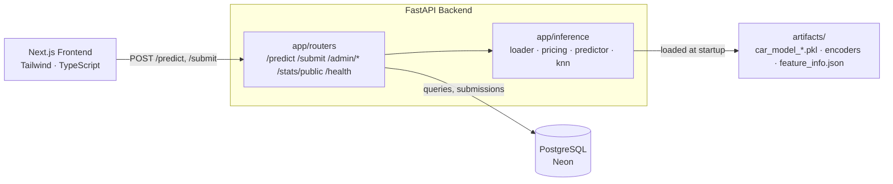
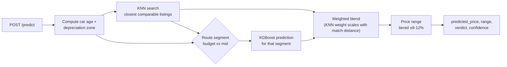
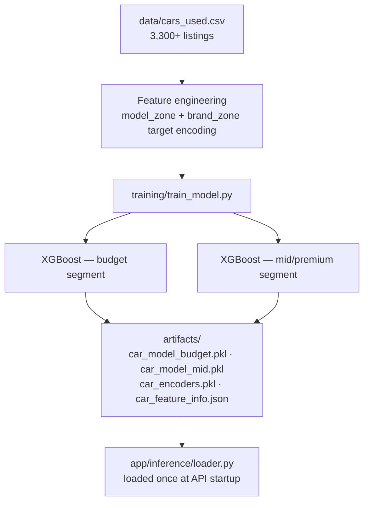

# AutoValu

**AI-powered used car price checker for the Tunisian market.**

AutoValu tells buyers and sellers whether a used car price is a great deal, fair, or overpriced instantly, based on real market data instead of gut feeling.

---

## What it does

- Enter a car's brand, model, year, mileage, fuel, condition, etc.
- Get a predicted fair market price with a confidence range
- If checking a listing price, get an instant verdict (excellent deal / fair / expensive / overpriced) with a suggested counter-offer
- Buyer mode (check a price you saw) and Seller mode (get a recommended asking price)
- Admin dashboard to review user-submitted prices and monitor usage stats

---

## The ML system

The core problem: a single model averages prices across wildly different vehicles, which poisons predictions (a Hilux and a Yaris from the same brand don't depreciate the same way).

- **Two segment-specific XGBoost models** (budget vs. mid/premium), routed dynamically based on a reference price
- **Model-zone target encoding**: prices are encoded per model *and* depreciation age zone (e.g. `hilux_z2`), not just per brand, so rare/expensive models aren't dragged toward the brand average
- **KNN nearest-neighbor search** finds the closest real comparable listings (same model, year, mileage, fuel, condition) and blends its estimate with the XGBoost prediction, weighted by how close the match is
- Trained on 3,300+ real Tunisian listings, cleaned and encoded from local marketplace data
- ~16.6% validation MAPE across both segments

---

## Tech Stack

| Layer | Technology |
|---|---|
| Frontend | Next.js 14, React, TypeScript, Tailwind CSS |
| Backend | FastAPI (single service API, ML inference, and persistence) |
| ML | XGBoost, scikit-learn, pandas |
| Database | PostgreSQL (Neon) |
| Deployment | Vercel (frontend), Render (backend) |

---

## Architecture

```
deals-analyzer/
├── frontend/              # Next.js + Tailwind — landing page, price checker
└── backend/               # FastAPI API, ML inference, training
    ├── app/                # the running API service
    │   ├── main.py         # app entry point, router registration, CORS
    │   ├── config.py        # env vars, paths (ARTIFACTS_DIR, DATA_DIR, DB_URL)
    │   ├── database.py       # PostgreSQL connection + schema
    │   ├── models/            # request/response schemas (Pydantic)
    │   ├── inference/          # runtime prediction logic
    │   │   ├── loader.py        # loads artifacts + KNN dataset once at startup
    │   │   ├── pricing.py        # verdicts, confidence, price range
    │   │   ├── predictor.py       # feature vectors, XGBoost inference
    │   │   └── knn.py              # nearest-neighbor comparable search
    │   └── routers/                 # /predict /submit /admin/* /stats/public /health
    ├── training/            # offline pipeline — train_model.py, never imported by app/
    ├── artifacts/           # trained model output (pkl + feature info json)
    └── data/                # cleaned training dataset (cars_used.csv)
```

### System overview



### Prediction flow



### Training pipeline



`training/` never runs as part of the live API it's a separate offline step that writes to `artifacts/`, which `app/inference/loader.py` reads from. Re-running `train_model.py` and restarting the API is the full retrain cycle.

---

## Admin Dashboard

- Review and approve/reject user-submitted real prices (used to grow the training dataset)
- Live stats: total queries, top searched brands, submission approval rates
- Full query log for auditing model behavior

---

## License

**All rights reserved.**

This project and its source code are proprietary. No part of this repository may be copied, modified, distributed, or used in any form without explicit written permission from the author. See [LICENSE](./LICENSE) for full terms.

© 2026 Safwen Ben Mabrouk

---

## Contact

**Safwen Ben Mabrouk** — Full-Stack Software Engineer
- Email: safwenbenmabrouk@gmail.com
- LinkedIn: [linkedin.com/in/safwen-ben-mabrouk](https://linkedin.com/in/safwen-ben-mabrouk)
- GitHub: [@Safwen-bm](https://github.com/Safwen-bm)